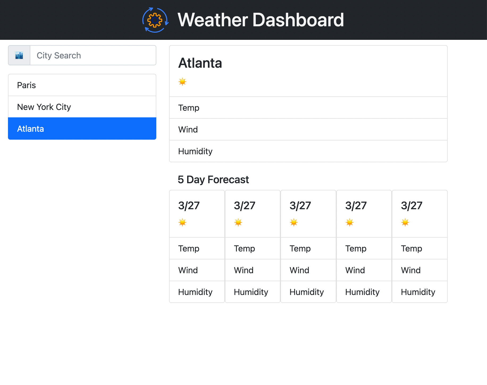

# Weather Dashboard
A weather dashboard that will run in the browser and feature dynamically updated HTML and CSS using JavaScript with sourced data from the OpenWeather service. 

## Description
A weather dashboard that allows a user to view weather by selected cities along with the city's five day forecast. This app will run in the browser and feature dynamically updated HTML and CSS powered by REST API calls to OpenWeather.

 The code highlights basic usage of the:
- Code to dynamically build the schedule HTML
- Use of JavaScript timer and event functions
- Writing and reading from local browser storage
- Interfacing with OpenWeather's REST API

## Installation

There are no installation requirements except to open the single `index.html` page or visit the page: https://qkeddy.github.io/weather-dashboard/.

## Sample Usage

The following image is a static image of the weather dashboard.

## Credits

N/A

## License

N/A

---

