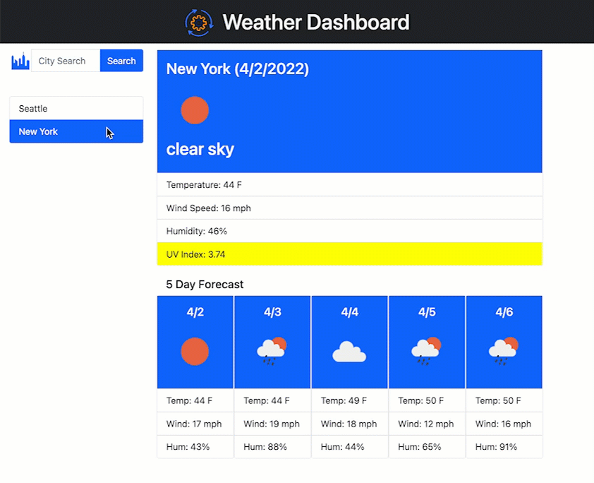

# Weather Dashboard
A weather dashboard that will run in the browser and display the current and five day forecast for any city in the world. All searched cities are saved for future use. 

## Description
This application is design to provide current and forecast weather to any city in the world with an easy and intuitive interface. Using JavaScript, this app features dynamically updated HTML and CSS styles with sourced data from the OpenWeather service via the services REST API. The interface is designed to support both desktop and mobile environments. 

 The code highlights basic usage of the:
- JavaScript to dynamically update the side bar displaying saved cities and the weather for a selected city.
- Timer and event function to display end-user notifications and respond to user input. 
- Local storage is used to save selected cities. 
- Interfaces with OpenWeather's REST API.

## Usage

This application can be found that the following [link](https://qkeddy.github.io/weather-dashboard/).

## Sample Usage

The following image is a static image of the weather dashboard.

### This application uses the following APIs and CSS frameworks:

* [OpenWeather](https://openweathermap.org/)
* [Bootstrap (CSS framework)](https://getbootstrap.com/)
* [Noun Project](https://thenounproject.com/)

## License

MIT License

Copyright (c) 2022 Quin Eddy

Permission is hereby granted, free of charge, to any person obtaining a copy
of this software and associated documentation files (the "Software"), to deal
in the Software without restriction, including without limitation the rights
to use, copy, modify, merge, publish, distribute, sublicense, and/or sell
copies of the Software, and to permit persons to whom the Software is
furnished to do so, subject to the following conditions:

The above copyright notice and this permission notice shall be included in all
copies or substantial portions of the Software.

THE SOFTWARE IS PROVIDED "AS IS", WITHOUT WARRANTY OF ANY KIND, EXPRESS OR
IMPLIED, INCLUDING BUT NOT LIMITED TO THE WARRANTIES OF MERCHANTABILITY,
FITNESS FOR A PARTICULAR PURPOSE AND NONINFRINGEMENT. IN NO EVENT SHALL THE
AUTHORS OR COPYRIGHT HOLDERS BE LIABLE FOR ANY CLAIM, DAMAGES OR OTHER
LIABILITY, WHETHER IN AN ACTION OF CONTRACT, TORT OR OTHERWISE, ARISING FROM,
OUT OF OR IN CONNECTION WITH THE SOFTWARE OR THE USE OR OTHER DEALINGS IN THE
SOFTWARE.

## How to Contribute

Please reach out to me if you would like to contribute to this project.

It is requested that all contributors adhere to the standards outlined in the [Contributor Covenant Code of Conduct](https://www.contributor-covenant.org/version/2/1/code_of_conduct/).

---

